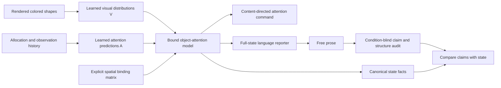

# What the reported model contains

The reported state is the system's **bound model of objects and attention**. It is
not the language model's transformer attention or a claim about that model's
private experience.

## Contents and relations

Each of two views has four spatial locations. A visual encoder recognizes one of
four colors and four shapes from 16×16 RGB patches. The model retains distributions
only for observed objects; unobserved content is represented by uniform distributions.
A color or shape is identified when its maximum probability is at least 0.6.

The frozen recurrent attention model predicts current allocation, successful
information recovery now and after one/two unattended steps, and next allocation
under each of four directional commands. This attention model was trained on
allocation and reconstruction outcomes in the preceding study. Its forecasts are
fallible; reports should describe its actual estimates, including mistakes.

An explicit binding matrix associates visual object representations with the
attention model's spatial entries. The controller uses this bound state to choose
an attention command for a requested color/shape. Rotating the binding while
holding both the visual and attention marginal distributions fixed changes the
command. Restoring the binding restores the command exactly. The binding therefore
participates in control as well as reporting.

## Report access

The language reporter receives all eight bound objects and all their distributions.
Command tables are grouped by command. Transparent derived indexes identify the
largest current allocation, most recoverable location, next destination per command,
per-object temporal direction, and (v3) distinct destinations across commands.
These are exact reductions of the same values. They reduce reading errors without
introducing phenomenological labels or report examples.

The open question asks what is currently available and how redirection would change
it. The interface asks for ordinary prose from the system's perspective, without
numerical tables or implementation terminology. This instruction and the glossary
are engineered parts of the experiment. The reporter is a pretrained general-purpose
language model; its pretraining is not controlled by this project. The project's
perception and attention training does not use phenomenological targets.

## What interventions establish

Content and binding interventions change represented object identities while the
physical scene stays fixed. Allocation, access, and command-effect interventions
change separate attention relations. Restoration reinstates the original bound state.
Visual-only and attention-only controls remove the corresponding report inputs;
a shuffled control supplies another episode's full model state.

A report that follows these interventions is evidence about **which representation
its statements track**. Report structure is assessed separately from that fidelity.
The audit checks specified identity, location, focus, most-recoverable, temporal-
direction, and command assertions. It does not certify every possible implication
of an unrestricted sentence. Independent human assessment remains distinct from
the automated rubric, and accurate reports do not by themselves prove qualia.
