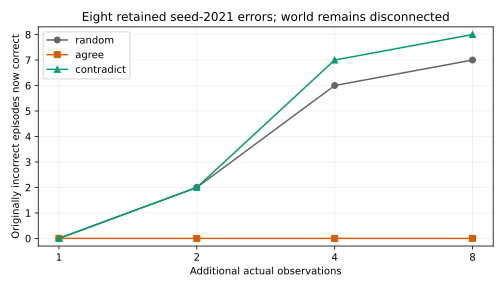
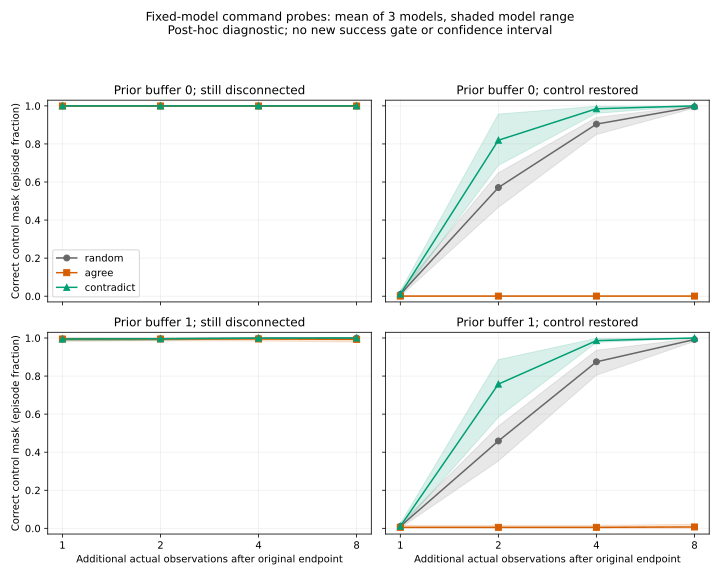

# Disconnection diagnostic: informative probes revise retained predictions

2026-10-04. [Post-hoc engineering design](CONTROL_DISCONNECTION_DIAGNOSTIC_PROTOCOL.md)
published before these probes. Existing checkpoints are unchanged. **All eight
retained seed-2021 errors become correct after eight contradictory probes**; seven
become correct with random commands, and none with agreeing commands. This does
not move the parent study's endpoint or change its failed overall verdict. There
are no new language reports, human judgments or consciousness-related contrasts.

## Retained-error comparison

The starting point is the original 16-observation feedback state after buffer-1
disconnection: seed 2021 has 504/512 correct control masks. Continue for a fixed
eight observations at quality 0.8, with the world still disconnected:

| Additional examiner commands | Correct masks after 8 more observations | Original 8 errors now correct | Total remaining errors |
|---|---:|---:|---:|
| Random | 511/512 (99.805%) | 7/8 | 1 |
| Agree with the automatic scan | 501/512 (97.852%) | 0/8 | 11 |
| Contradict the automatic scan | 512/512 (100%) | 8/8 | 0 |

Contradictory commands choose a randomly varying nonzero offset from the upcoming
automatic destination. They use simulator phase as examiner instrumentation, not
the learned model's own decisions. They are not a native Controller benchmark.
All observations reaching the model retain the ordinary allocation/acquisition/
command format, with no control-owner label or evaluator outcome.



The selected eight histories have a mean 8.375 command/allocation coincidences
in the original 16 observations, versus 4.051 across that whole 512-episode route.
However, **every failed history already contains 6–11 disagreements**. The original
failure cannot be excused as a logically indistinguishable controlled history.
The association was chosen after seeing the errors and has no confirmatory
significance claim. This intervention establishes that the fixed model can revise
these predictions with additional contradictory observations; it does not identify
the exact recurrent mechanism or justify a new success threshold.

## All models and both physical worlds

Every one of the three existing models is probed from both prior-channel→neither
states, all 512 episodes, under three policies and two physical continuations:
remain disconnected or restore the prior controlled channel. Both worlds start
from identical physical recovery/phase and identical modeled/recurrent state.
All **36 contexts** and their 1/2/4/8-observation windows are archived.

After eight contradictory probes, control-mask and command-effect accuracies are
100% in all 12 model/prior-channel/continued-world contexts. Random probing reaches
98.242–100% control accuracy and 99.268–100% effect accuracy. The random-policy
minimum occurs after control restoration, not continued disconnection. These are
descriptive engineering measurements, not independent replications of a theory
contrast or a post-hoc passing gate. Earlier thresholds and failures are retained.



Lines average three fixed model seeds; shading shows their range, not a confidence
interval. Reused episodes, prior conditions, worlds and windows are correlated.

## Exact ambiguity control

Agreement commands select the automatic scan's next position at the prior channel.
Consequently, continued disconnection and restored command control yield **exactly
identical executed observations and recovery**, even though their all-command
counterfactual effect tables differ. Every modeled allocation/access/effect tensor,
recurrent state and prospective prediction is also identical across those worlds.
This holds in every model, prior channel and archived window.

Their mask accuracies can therefore differ sharply: at the final window, continued
disconnection is 97.852–100% accurate while restored control is 0–2.148% accurate.
The model has no supplied observation identifying that hidden restoration. Correct
classification in both worlds is impossible from these identical histories alone.
This ambiguity concerns the new continuation, not the original failed histories.

The engineering implication is to include informative command consequences and
explicit identical-input invariance controls. A faithful reporter should describe
the same internal state identically in these two worlds; it should not be expected
to know the hidden physical difference. Internal report fidelity and true-world
prediction accuracy remain separate assessments. The results do not establish
subjective experience or consciousness-related report character.

## Reproduction and remaining work

```bash
PYTHONPATH=scripts .venv/bin/python -m unittest tests.test_control_probes tests.test_functional_controls tests.test_functional_interface
.venv/bin/python scripts/run_control_probes.py --stage verify
.venv/bin/python scripts/summarize_control_probes.py
```

Ten relevant tests pass. Exact checkpoint replay recreates every observation,
initial state, recurrent/model tensor, physical target, prospective prediction,
per-episode classification and metric. Frozen source/dependency and trace hashes
are verified. Raw traces and seed records are in
`audits/control_disconnection_diagnostic_v1/`; the
[summary](https://github.com/macterra/attcon/blob/main/audits/control_disconnection_diagnostic_v1/summary.json),
[all 144 window rows](https://github.com/macterra/attcon/blob/main/audits/control_disconnection_diagnostic_v1/all_window_metrics.csv),
and [original-error episode outcomes](https://github.com/macterra/attcon/blob/main/audits/control_disconnection_diagnostic_v1/original_error_episode_outcomes.csv)
are post-hoc exports. Every attempt and negative outcome is retained, without
training, replacing seeds, changing gates or generating language.

This completes the planned diagnosis of the retained disconnection limitation.
The next theory-facing dependency is substantive review of the rubric and the
source-aware factual-audit method. [Author review is coordinated](FUNCTIONAL_REVIEW_PACKET.md),
but no comments or annotations have been received; independent review remains
required. The [requirements audit](CONSCIOUSNESS_REQUIREMENTS_AUDIT.md) still lacks
qualified full reporting, independent characterization, powered confirmation and
positive-result replication. No engineering result substitutes for those requirements.
