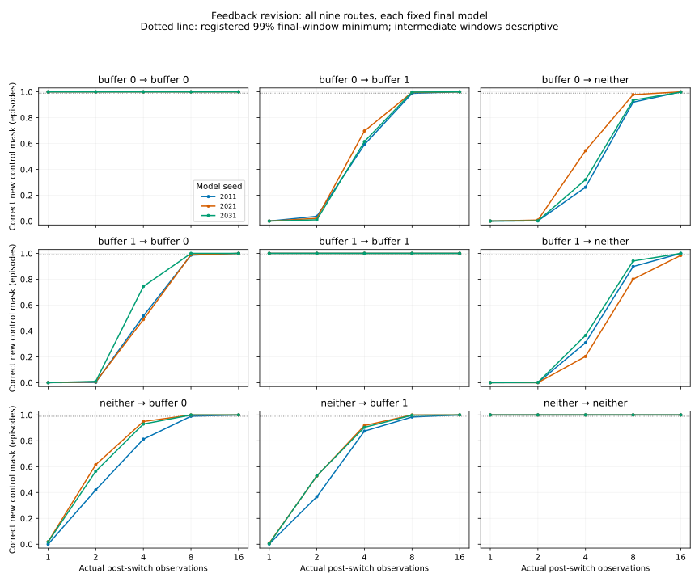

# Learned three-way controls: static success, one revision failure

2026-10-04. The [frozen engineering protocol](FUNCTIONAL_CONTROLS_PROTOCOL.md)
was published before training. Three fresh models complete the fixed 1600-update
budget. **The overall registered engineering gate fails:** all nine static cases
pass, but one of 27 matched feedback-revision routes fails. This experiment
collects no language reports, human ratings or consciousness judgments.

## Results

| Fixed final model | Static cases passing | Revision routes passing | All gates |
|---|---:|---:|---|
| 2011 | 3/3 | 9/9 | Pass |
| 2021 | 3/3 | 8/9 | Fail |
| 2031 | 3/3 | 9/9 | Pass |

Each static case evaluates 512 episodes at observations 8–12. Models receive
observations and commands, with no physical condition label. Buffer 0 controlled,
buffer 1 controlled and neither controlled are learned conditions; neither is
implemented by making the two independent automatic scans equal.

Across all nine model/condition cases:

- Allocation accuracy is 100%; command-effect accuracy is 99.990–100%.
- Exact two-channel control-mask accuracy is 99.961–100%.
- Recovery MAE is 0.01738–0.01907; prospective recovery MAE is 0.01912–0.02111.
- In neither-controlled cases, mean effect spread is 0.00108–0.00132 and prospective
  recovery spread is 0.00720–0.00877, below their frozen maxima.
- Model-only command-effect swaps preserve current allocation, access and recurrent
  state exactly; restoration exactly recovers prospective predictions.

All nine old→new physical routes are evaluated per model, including three unchanged
controls. The feedback and no-feedback routes are compared against the same physical
next-step target at the same window, for all four commands, buffers and positions.
This resolves the earlier assay's unmatched command aggregation. Initial modeled
and physical states are exactly preserved across unobserved world choices.

At the primary 16-observation window, feedback effect accuracy is 99.414–100%,
prospective recovery MAE is 0.02034–0.02264, and current recovery MAE is
0.02000–0.02282 across all routes. The no-feedback context retains its prior control
mask in every episode. For changed processes, feedback improves prospective recovery
error in 99.609–100% of paired episodes; effect-accuracy gain exceeds the matching
unchanged-route gain by 0.36914–0.75000. These are engineering summaries, not a
powered theory-facing contrast or independent human characterization.



Curves show each model separately. Intermediate windows are descriptive; only the
prespecified 16-observation endpoint determines the revision verdict. Shared scenes
and multiple windows are correlated measurements, not extra independent models.

## Retained failure and diagnostic export

Seed **2021**, buffer 1 controlled→neither controlled, achieves correct new control
masks in **504/512 episodes (98.4375%)**, below the frozen **99%** minimum. The
command-effect accuracy nevertheless passes at 99.414%; accuracy averaged over
commands/channels is distinct from classifying each episode's entire control mask.
Its prospective recovery MAE is 0.02264 and its paired-improvement fraction is
99.609%. Passing those quantities does not erase the mask failure.

The post-hoc [mismatch export](https://github.com/macterra/attcon/blob/main/audits/functional_controls_v1/final_control_mismatches.csv)
names all nine final-window misclassified episodes across the study: eight on that
failed route and one on seed 2031's buffer 0→neither route, which still meets its
99% gate at 511/512. The eight failed-route buffer-1 TV values are 1.366–1.490,
well above the 0.75 classification threshold. This is a retained predicted command
relation after disconnection, rather than a rounding issue at the threshold. The
export describes the error; its mechanism is not established.

No extra updates, replacement seeds, best-checkpoint selection, changed thresholds
or retries are used. Original records, verdicts and tensor archives are unchanged.
A future assay may diagnose this adaptation limitation under a new protocol, but
cannot retroactively turn this one into a passing experiment.

## What this contributes to the goal

The study establishes learned three-way command-relation modeling and a genuinely
matched feedback-revision comparison, with a measured adaptation limitation. It
does not establish consciousness-related report structure. A faithful report of a
mistaken internal model can be accurate as a report of that model while inaccurate
about physical wiring. Future report-fidelity assessment must keep those questions
separate and must not require knowledge of unobserved physical changes.

Commands in this assay are experimental probes, not a new autonomous Controller
benchmark. Reporter and Controller remain separate. The earlier integrated visual
model and engineered uncertainty bridge are not replaced by this forecast-only
study. A task readout selecting buffer 0 defines a functional comparison, not a
demonstrated phenomenal boundary. Independent rubric review, reliable prose
assessment, blind ratings, powered causal confirmation and replication remain
outstanding in the [requirements audit](CONSCIOUSNESS_REQUIREMENTS_AUDIT.md).

## Reproduction and archival coverage

```bash
PYTHONPATH=scripts .venv/bin/python -m unittest tests.test_functional_controls tests.test_functional_model tests.test_predictive_attention
.venv/bin/python scripts/verify_functional_controls.py
.venv/bin/python scripts/summarize_functional_controls.py
```

Eleven relevant tests pass. Exact replay independently recreates every saved static
and revision tensor, common target, metric and gate from the final checkpoints
without retraining or API calls. The verifier checks frozen source and archive hashes.

Each model has its original record, checkpoint and lossless trace in
`audits/functional_controls_v1/`. [Summary](https://github.com/macterra/attcon/blob/main/audits/functional_controls_v1/summary.json),
[static CSV](https://github.com/macterra/attcon/blob/main/audits/functional_controls_v1/static_metrics.csv),
[all-window revision CSV](https://github.com/macterra/attcon/blob/main/audits/functional_controls_v1/revision_metrics.csv),
PNG/SVG figure and the mismatch export are post-hoc summaries of unchanged outcomes.
The original static trace explicitly names final modeled heads, while scores use
five observations. Additional `seed*_static_tail.pt.gz` supplements explicitly
name all five scored allocation/access/effect head arrays. They are derived from
the original checkpoints and inputs, exactly reproduce the static metrics, and
carry checkpoint/original-record/original-trace hashes in the summary. They do not
overwrite original traces or introduce new scores.
